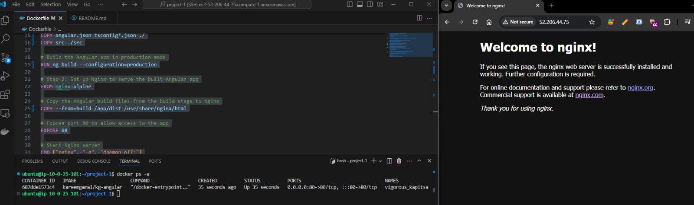

# Angular Application Dockerfile

This project uses Docker to containerize an Angular application, which is built using Node.js and served by Nginx. The following steps outline the process of building and serving the Angular app in a Docker container.

## Dockerfile Details

This `Dockerfile` consists of two main stages:

### **Stage 1: Build the Angular App using Node.js**

1. **Base Image**: We use the `node:18` image to build the Angular application.
2. **Working Directory**: The container's working directory is set to `/app`.
3. **Copying Files**: The `package.json` and `package-lock.json` files are copied into the container. These files are essential for installing the app's dependencies.
4. **Installing Dependencies**: The Angular CLI is installed globally using `npm install -g @angular/cli`, and then the project dependencies are installed with `npm install --verbose`.
5. **Copying Application Code**: The Angular configuration files (`angular.json`, `tsconfig.json`, etc.) and the `src` directory are copied into the container.
6. **Building the Application**: The Angular application is built in production mode with the command `ng build --configuration=production`.

### **Stage 2: Set up Nginx to Serve the Angular App**

1. **Base Image**: We use the `nginx:alpine` image for serving the application.
2. **Copy Build Files**: The build files from the Angular build stage are copied into Nginx’s default directory (`/usr/share/nginx/html`).
3. **Expose Port**: The container exposes port 80 to allow HTTP access to the app.
4. **Nginx Command**: The container runs the Nginx server with the command `nginx -g 'daemon off;'`.

---

## How to Build and Push the Docker Image

To build and push this Docker image to your Docker Hub account, follow these steps:

### **1. Build the Docker Image**

Run the following command to build the Docker image:

```bash
docker build -t kareemgamal/kg-angular .
```

This command will create an image named `kareemgamal/kg-angular` from the Dockerfile in the current directory.

### **2. Log in to Docker Hub**

If you are not already logged in, log in to your Docker Hub account:

```bash
docker login
```

### **3. Push the Docker Image to Docker Hub**

Once the image is built and you're logged into Docker Hub, run the following command to push the image:

```bash
docker push kareemgamal/kg-angular
```

This will push the image to your Docker Hub account under the repository `kareemgamal/kg-angular`.

You can view your Docker image on Docker Hub by visiting:  
[https://hub.docker.com/r/kareemgamal/kg-angular](https://hub.docker.com/r/kareemgamal/kg-angular)

---

## Final Image

Here’s the image representing the Dockerized Angular application:


